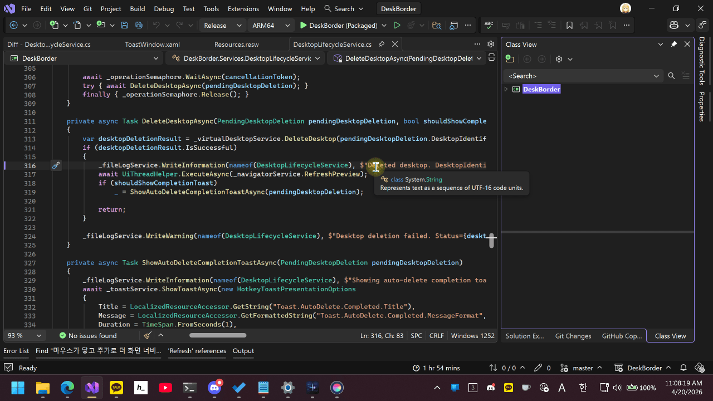

# DeskBorder

🌐 [한국어](README.ko.md)

DeskBorder is a Windows utility designed for people who use virtual desktops throughout the day.
Move your mouse to the edge of the screen to switch desktops, create a new desktop when you need more space, move the focused window with hotkeys, and open a compact navigator overlay for a quick overview.

## Features

- Switch virtual desktops by touching the left or right edge of the screen
- Create a new desktop when you reach the outer edge and need another workspace
- Automatically remove empty outer desktops to keep things tidy
- Prevent accidental edge switching while holding a mouse button during drag-and-drop
- Automatically blacklist game-detected processes, with a whitelist for exceptions
- Require extra mouse movement past the edge before switching or creating a desktop
- Move the focused window to the previous or next desktop with hotkeys
- Open a navigator overlay to see desktops at a glance
- Run quietly from the tray with a simple settings window

## Libraries Used

- [Microsoft.WindowsAppSDK](https://github.com/microsoft/WindowsAppSDK) - WinUI 3 app platform and Windows integration
- [CommunityToolkit.Mvvm](https://github.com/CommunityToolkit/dotnet) - MVVM helpers and source generators
- [CommunityToolkit.WinUI.Converters](https://github.com/CommunityToolkit/Windows) - WinUI value converters
- [DevWinUI.Controls](https://github.com/ghost1372/DevWinUI) - additional WinUI controls used in settings and dialogs
- [H.NotifyIcon.WinUI](https://github.com/HavenDV/H.NotifyIcon) - tray icon integration
- [Microsoft.Extensions.DependencyInjection](https://github.com/dotnet/runtime) - dependency injection container
- [WinUIEx](https://github.com/dotMorten/WinUIEx) - extra windowing helpers for WinUI

## License

This project is distributed under the [MIT License](LICENSE.txt).

## Acknowledgement

This project was written with partial assistance from [GitHub Copilot](https://github.com/features/copilot).
Virtual desktop interoperability support was implemented with reference to [MScholtes/VirtualDesktop](https://github.com/MScholtes/VirtualDesktop).

## Author

**Howon Lee** ([airtaxi](https://github.com/airtaxi))
